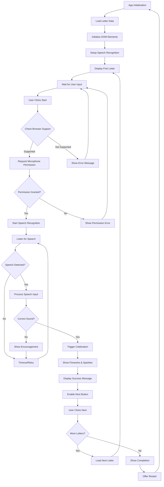
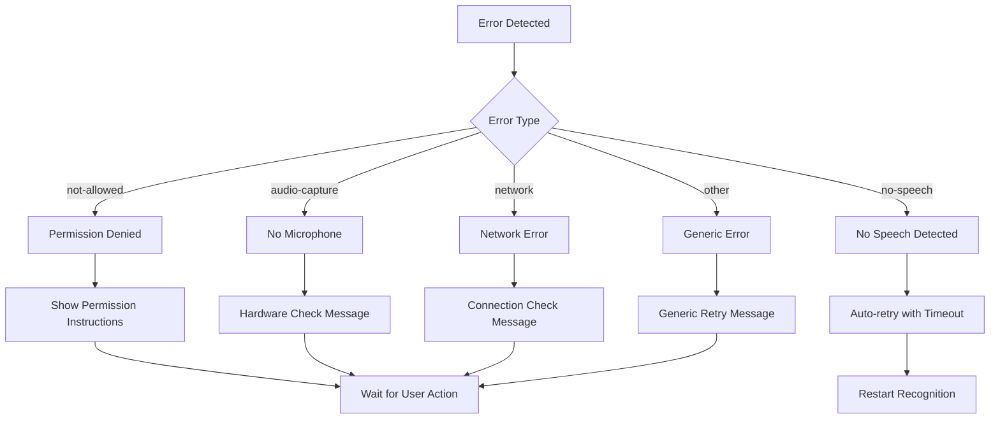
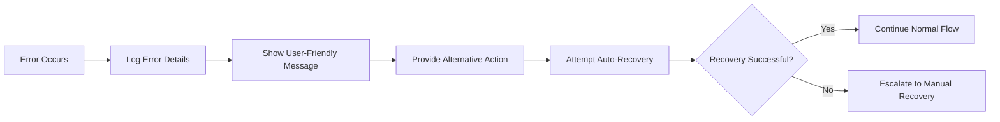

# 🎵 Phonics Learning App 🎵

A child-focused interactive web application for learning phonics through speech recognition. Children learn letter sounds by speaking into their microphone and get rewarded with sparkles and fireworks when they pronounce letters correctly!


## Features

- **Interactive Letter Learning**: Shows each letter A-Z with corresponding emoji images
- **Speech Recognition**: Uses Web Speech API to listen for correct letter pronunciation
- **Celebration Animations**: Sparkles and fireworks when children succeed
- **Child-Friendly Design**: Colorful gradients, large buttons, and fun emojis
- **Progress Tracking**: Visual progress bar showing current letter position
- **Responsive Design**: Works on desktop, tablet, and mobile devices

## How to Use

1. Open the application in a web browser that supports speech recognition (Chrome, Safari, Edge)
2. Click "🎤 Start Learning!" to begin
3. Allow microphone permissions when prompted
4. Say the sound for the displayed letter (e.g., "ay" for A, "buh" for B)
5. Enjoy the celebration when you get it right!
6. Click "Next Letter ➡️" to progress through the alphabet

## Example Letter Sounds

- A - "ay" (as in Apple 🍎)
- B - "buh" (as in Boat 🚤)
- C - "kuh" (as in Cat 🐱)
- D - "duh" (as in Dog 🐶)
- And so on through Z!

## Technical Requirements

- Modern web browser with Web Speech API support
- Microphone access
- Internet connection (for speech recognition service)

## Running the App

### Option 1: Simple HTTP Server (Recommended)
```bash
# Using Python 3
python3 -m http.server 8080

# Using Node.js
npx http-server -p 8080

# Then open http://localhost:8080 in your browser
```

### Option 2: Direct File Access
Simply open `index.html` in your web browser (note: some browsers may restrict microphone access for file:// URLs)

## Browser Compatibility

- ✅ Chrome (full support)
- ✅ Safari (full support)
- ✅ Edge (full support)
- ❌ Firefox (limited speech recognition support)

## Files Structure

- `index.html` - Main application structure
- `styles.css` - Child-friendly styling and animations
- `script.js` - Speech recognition and game logic
- `images/` - Placeholder directory (app uses emojis instead)

## Celebration Features

When children correctly pronounce a letter sound, they see:
- ✨ Animated sparkles
- 🎆 Fireworks effects
- 🎉 Success message overlay
- Automatic progression to next letter


## Educational Design

The app follows phonics teaching principles:
- Focuses on letter sounds rather than letter names
- Uses familiar objects that start with each letter sound
- Provides immediate positive feedback
- Encourages repeated practice through engaging animations
- Progresses systematically through the alphabet

Perfect for preschool and early elementary children learning to read!

---

## 🔧 Technical Documentation

### Architecture Overview

The Phonics Learning App follows a modular, event-driven architecture built on top of modern web APIs:

```
┌─────────────────────────────────────────────────────────────┐
│                    Phonics Learning App                     │
├─────────────────────────────────────────────────────────────┤
│  Presentation Layer (HTML/CSS)                             │
│  ├── Responsive UI Components                              │
│  ├── CSS Animations & Transitions                          │
│  └── Accessibility Features                                │
├─────────────────────────────────────────────────────────────┤
│  Application Layer (JavaScript)                            │
│  ├── PhonicApp Class (Main Controller)                     │
│  ├── Speech Recognition Handler                            │
│  ├── Animation Controller                                  │
│  └── Progress Tracker                                      │
├─────────────────────────────────────────────────────────────┤
│  Web APIs                                                  │
│  ├── Web Speech API (SpeechRecognition)                   │
│  ├── DOM Manipulation APIs                                 │
│  └── CSS Animation APIs                                    │
└─────────────────────────────────────────────────────────────┘
```

### System Flow Diagram



### Component Architecture

#### 1. PhonicApp Class
**Purpose**: Main application controller that orchestrates all functionality

**Key Properties**:
- `currentLetterIndex`: Tracks progress through alphabet (0-25)
- `recognition`: SpeechRecognition API instance
- `isListening`: Boolean flag for microphone state
- `letters`: Array of 26 letter objects with phonetic data

**Key Methods**:
- `initializeElements()`: Caches DOM references for performance
- `initializeSpeechRecognition()`: Configures Web Speech API
- `updateDisplay()`: Updates UI with current letter data
- `processResult()`: Analyzes speech input for correctness
- `celebrateSuccess()`: Triggers celebration animations

#### 2. Speech Recognition System

```
┌─────────────────────────────────────────────────────────────┐
│                Speech Recognition Pipeline                  │
├─────────────────────────────────────────────────────────────┤
│  Input: User's voice → Microphone                          │
│                                                             │
│  Processing:                                                │
│  ├── Browser's Speech Recognition API                      │
│  ├── Audio → Text Conversion                               │
│  ├── Confidence Scoring                                    │
│  └── Result Callback                                       │
│                                                             │
│  Analysis:                                                  │
│  ├── Compare with expected sounds                          │
│  ├── Phonetic matching algorithm                           │
│  ├── Alternative pronunciation handling                    │
│  └── Success/Failure determination                         │
│                                                             │
│  Output: Celebration or Retry prompt                       │
└─────────────────────────────────────────────────────────────┘
```

**Phonetic Matching Algorithm**:
```javascript
// Multi-layer matching approach:
1. Exact sound match: "ay" matches "ay"
2. Letter name match: "a" matches letter A
3. Word match: "apple" matches Apple
4. Phonetic alternatives: ["a", "hey", "way"] for "ay"
```

#### 3. Animation System

**Celebration Sequence**:
1. **Overlay Display**: Semi-transparent background with modal
2. **Fireworks Effect**: CSS keyframe animations with scaling circles
3. **Sparkle Generation**: Dynamic DOM elements with randomized positions
4. **Success Message**: Encouraging text with emoji
5. **Auto-cleanup**: Timeout-based element removal after 3 seconds

### Data Flow

```
User Input → Speech API → Text Result → Phonetic Analysis → 
UI Update → Animation Trigger → Progress Update → State Change
```

### Error Handling Strategy



### Performance Considerations

**Optimization Strategies**:
- **DOM Caching**: All elements cached during initialization
- **Event Delegation**: Minimal event listeners for better memory usage
- **CSS Hardware Acceleration**: `transform3d()` for smooth animations
- **Debounced Recognition**: Prevents multiple simultaneous recognition attempts
- **Lazy Animation Cleanup**: Removes temporary sparkle elements automatically

**Memory Management**:
- No memory leaks from unclosed recognition sessions
- Automatic cleanup of dynamically created animation elements
- Efficient emoji rendering without external image resources

### Browser API Dependencies

| API | Purpose | Fallback |
|-----|---------|----------|
| **Web Speech API** | Voice recognition | Error message + manual progression |
| **DOM API** | UI manipulation | N/A (Required) |
| **CSS Animations** | Visual feedback | Static fallback |
| **localStorage** | Could store progress | Session-only progress |

---

## ⚠️ Limitations & Known Issues

### Technical Limitations

#### 1. **Browser Compatibility**
- **Firefox**: Limited Web Speech API support (requires additional setup)
- **Internet Explorer**: No Web Speech API support
- **Older Browsers**: May lack CSS animation support for celebrations

#### 2. **Speech Recognition Accuracy**
- **Background Noise**: Can interfere with recognition accuracy
- **Accent Variations**: May not recognize all regional accents equally
- **Child Voices**: Some difficulty with very young children's speech patterns
- **Pronunciation Variations**: Limited phonetic alternatives programmed

#### 3. **Hardware Dependencies**
- **Microphone Required**: No fallback for users without microphone access
- **Internet Connection**: Speech recognition requires network connectivity
- **Device Performance**: Animations may lag on older/slower devices

#### 4. **Privacy & Security**
- **Audio Data**: Voice data processed by browser's speech service
- **Microphone Permissions**: Requires explicit user consent
- **Network Traffic**: Audio sent to speech recognition servers

### Educational Limitations

#### 1. **Phonics Scope**
- **Single Letter Focus**: Only covers individual letter sounds, not blends
- **No Phoneme Combinations**: Doesn't teach "ch", "th", "sh" sounds
- **American English**: Phonetic mappings based on American pronunciation
- **No Contextual Learning**: Letters taught in isolation, not in words

#### 2. **Learning Style Support**
- **Audio-Primary**: Limited support for visual-only learners
- **No Progress Persistence**: Progress resets on page reload
- **No Adaptive Difficulty**: Same recognition threshold for all users
- **No Assessment**: No detailed tracking of learning effectiveness

#### 3. **Accessibility Concerns**
- **Motor Skills**: Requires fine motor control for button clicking
- **Hearing Impaired**: No visual alternatives for audio feedback
- **Cognitive Load**: May overwhelm children with attention difficulties

### Performance Limitations

#### 1. **Recognition Latency**
- **Network Delay**: 1-3 second delay for speech processing
- **Processing Time**: Additional time for phonetic analysis
- **Retry Overhead**: Multiple attempts slow down learning flow

#### 2. **Animation Performance**
- **CPU Intensive**: Celebrations may cause frame drops on low-end devices
- **Memory Usage**: Dynamic sparkle generation increases memory footprint
- **Battery Impact**: Continuous microphone access drains mobile batteries

#### 3. **Scalability Issues**
- **Single User**: No multi-user support or profiles
- **No Data Persistence**: Cannot save progress across sessions
- **Static Content**: Letter set cannot be customized or extended

### Recommended Improvements

#### Short-term Fixes:
1. **Add visual feedback** for users without microphone access
2. **Implement progress saving** using localStorage
3. **Add pronunciation guides** with audio examples
4. **Optimize animations** for better performance

#### Long-term Enhancements:
1. **Offline speech recognition** using browser-native APIs
2. **Adaptive difficulty** based on user performance
3. **Multi-language support** for international users
4. **Teacher dashboard** for classroom use
5. **Learning analytics** and progress reports

### Error Recovery Strategies



---

## 🚀 Future Roadmap

### Phase 1: Core Improvements
- [ ] Add visual pronunciation guides
- [ ] Implement progress persistence
- [ ] Optimize for mobile performance
- [ ] Add keyboard navigation support

### Phase 2: Educational Enhancement
- [ ] Letter blend recognition (ch, th, sh)
- [ ] Word formation games
- [ ] Assessment and progress tracking
- [ ] Adaptive difficulty adjustment

### Phase 3: Platform Expansion
- [ ] Teacher/parent dashboard
- [ ] Multi-user profiles
- [ ] Offline mode support
- [ ] Native mobile app development

Perfect for preschool and early elementary children learning to read!